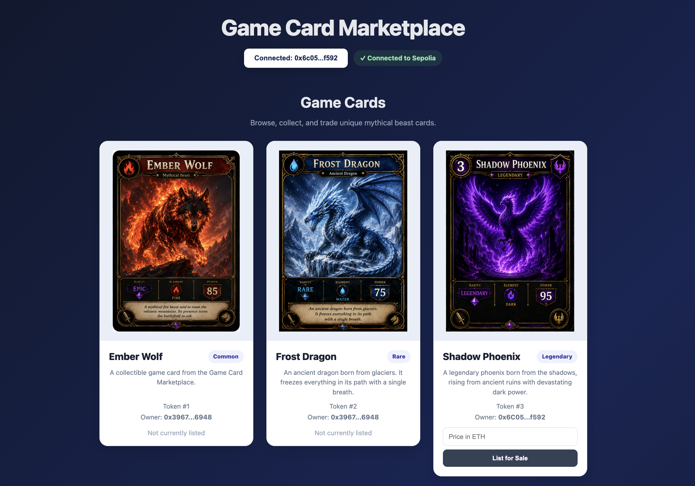
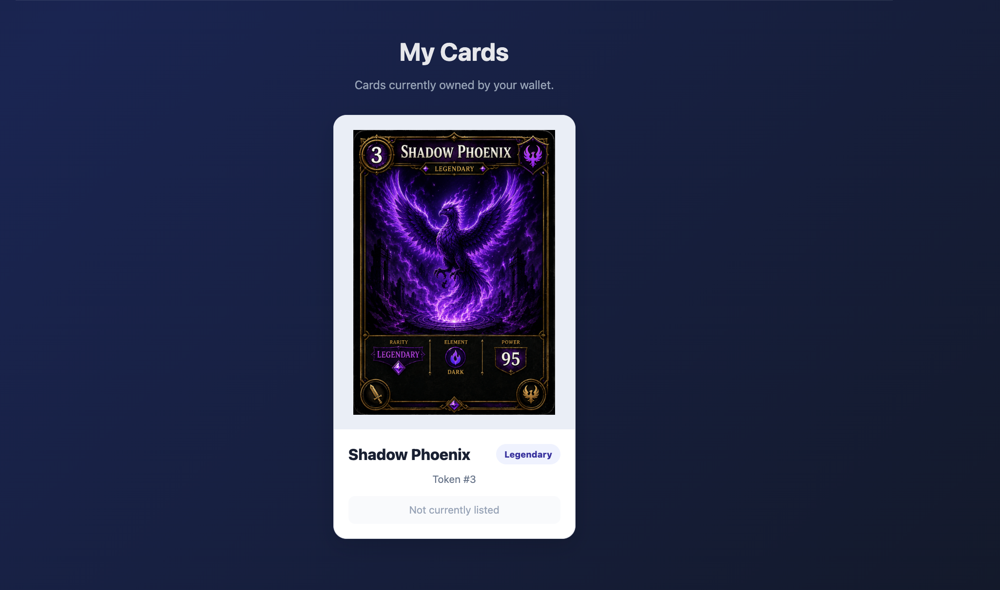
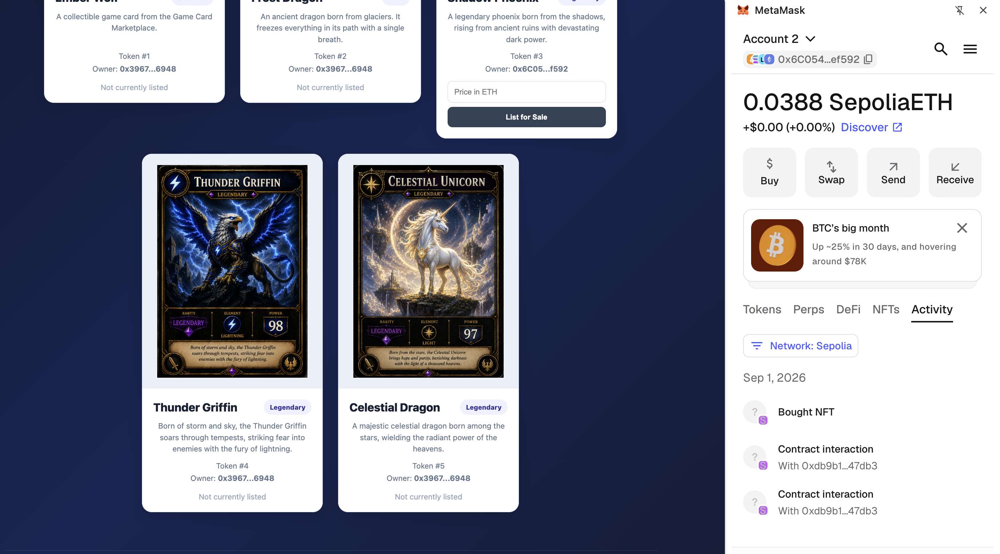

# 🎴 Game Card Marketplace

A decentralized marketplace for minting, collecting, listing, and trading unique digital game cards as NFTs on the Ethereum Sepolia testnet.

Each game card is represented as an ERC-721 NFT with a unique token ID. Card images and metadata are stored using IPFS, while ownership and marketplace transactions are handled through a Solidity smart contract.

---

## 📌 Project Overview & Features

The Game Card Marketplace is a decentralized application (dApp) that allows users to interact with unique digital game cards on the Ethereum Sepolia testnet.

Users can:

- Mint unique game cards
- View game cards in a marketplace gallery
- Connect their MetaMask wallet
- View cards owned by their wallet
- List owned cards for sale
- Buy cards listed by other users
- View card metadata such as name, description, and rarity
- Verify that the connected wallet is using the Sepolia network

### Features

- 🎴 ERC-721 NFT game cards
- 🔢 Unique token IDs
- 🖼️ IPFS-stored images and metadata
- 💰 Card listing and purchasing
- 🦊 MetaMask wallet integration
- 🔗 Ethereum Sepolia testnet integration
- 👛 My Cards section for displaying owned NFTs
- 🎨 Marketplace/gallery interface
- 🏷️ Card names, descriptions, and rarity attributes
- 🌐 Sepolia network verification
- 📱 Clean and responsive card layout

---

## 🛠️ Tech Stack

### Blockchain

- Ethereum
- Sepolia Testnet
- Solidity
- ERC-721

### Smart Contract Development

- Hardhat
- OpenZeppelin Contracts
- ethers.js
- TypeScript
- Mocha

### Frontend

- React
- TypeScript
- Vite
- ethers.js

### Wallet

- MetaMask

### Decentralized Storage

- IPFS
- Pinata IPFS Gateway

---

## ⚙️ Setup Instructions

### Prerequisites

Make sure the following are installed:

- Node.js
- npm
- Git
- MetaMask

MetaMask should be configured with the Ethereum Sepolia test network.

You will also need some Sepolia test ETH for blockchain transactions.

### 1. Clone the Repository

    git clone <YOUR_GITHUB_REPOSITORY_URL>
    cd game-card-marketplace

### 2. Install Dependencies

From the project root:

    npm install

### 3. Compile the Smart Contract

    npx hardhat compile

### 4. Run Tests

    npx hardhat test

### 5. Run the Frontend

Navigate to the frontend directory:

    cd frontend

Install the frontend dependencies:

    npm install

Start the development server:

    npm run dev

Vite will provide a local URL in the terminal, usually:

    http://localhost:5173

Open this URL in your browser.

### 6. Connect MetaMask

1. Open MetaMask.
2. Switch to the Ethereum Sepolia network.
3. Open the Game Card Marketplace.
4. Click Connect Wallet.
5. Approve the connection in MetaMask.
6. The application will verify the connected network.

When connected to the correct network, the application displays:

    ✓ Connected to Sepolia

---

## 🌐 Testnet & Contract Address

### Testnet

Network: Ethereum Sepolia Testnet

Chain ID: 11155111

### Smart Contract Address

    0xeaFBdB1030F7363B89e533e55AD07fD3a9E5B4DF

The frontend uses this deployed contract to interact with the GameCard NFTs and marketplace.

---

## 📦 IPFS Implementation

The project uses IPFS (InterPlanetary File System) to store game card images and metadata.

Instead of storing large images directly on the Ethereum blockchain, each NFT stores a metadata URI that points to its corresponding IPFS metadata.

The metadata contains:

- Card name
- Card description
- Card image
- Rarity

Example metadata:

    {
      "name": "Ember Wolf",
      "description": "A collectible game card from the Game Card Marketplace.",
      "image": "ipfs://<image-CID>",
      "attributes": [
        {
          "trait_type": "Rarity",
          "value": "Common"
        }
      ]
    }

The card image is also stored on IPFS.

The smart contract stores the metadata URI when the NFT is minted.

The frontend retrieves the metadata using the stored IPFS URI and converts the IPFS URI into a Pinata gateway URL so that the card artwork and metadata can be displayed in the browser.

This allows the blockchain to maintain NFT ownership while IPFS handles the decentralized storage of the card artwork and metadata.

---

## 🖼️ Screenshots

Screenshots of the completed Game Card Marketplace will be added below.

### Game Cards

### My Cards

### Sepolia Connection

---

## 🚀 Deployed Link

### Frontend

The Game Card Marketplace is deployed and publicly accessible here:

https://game-card-marketplace.vercel.app

### Smart Contract

The smart contract is deployed on the Ethereum Sepolia testnet at:

0xeaFBdB1030F7363B89e533e55AD07fD3a9E5B4DF

### Smart Contract

The smart contract is deployed on the Ethereum Sepolia testnet at:

    0xeaFBdB1030F7363B89e533e55AD07fD3a9E5B4DF
